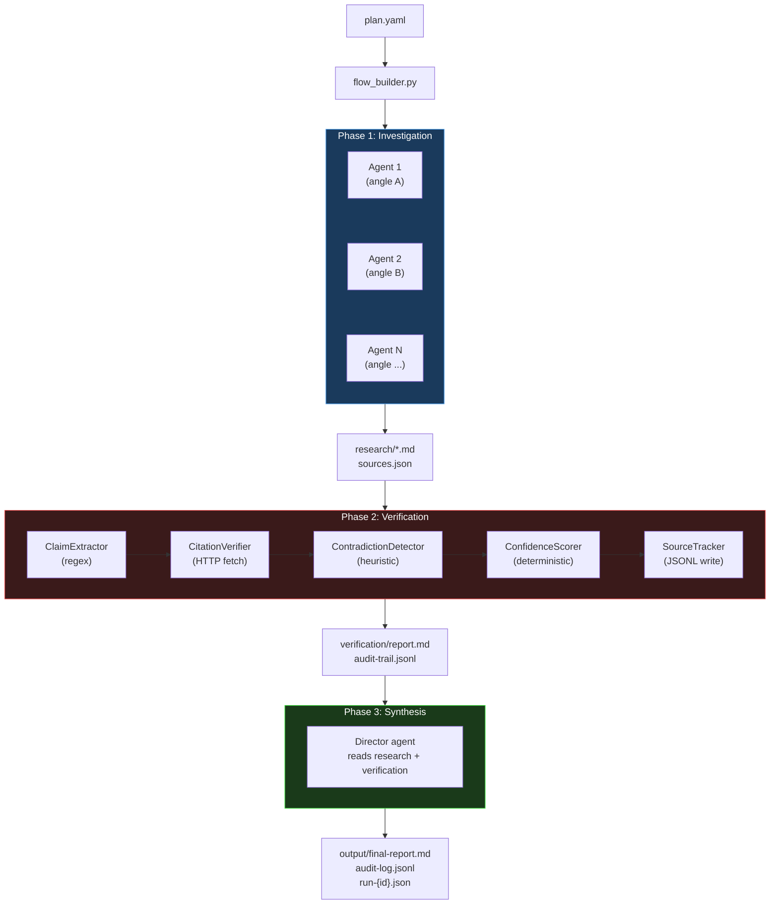
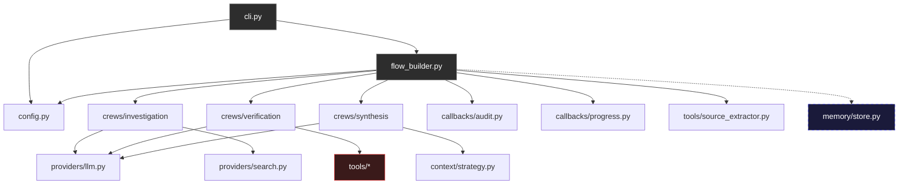
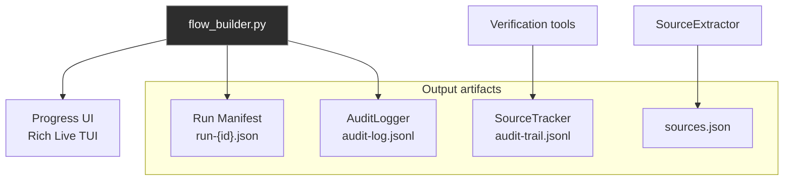
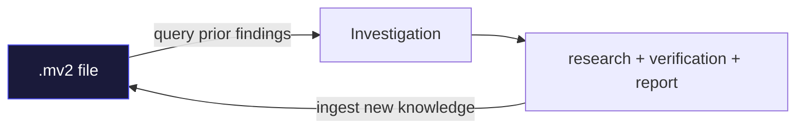

# Architecture

Technical reference for Recon's internals. For usage and quickstart, see
[README.md](README.md).

## Pipeline overview

Recon executes a 3-phase pipeline orchestrated by `flow_builder.py`:



| Phase | Agents | Max iterations | LLM calls | Output |
|-------|--------|----------------|-----------|--------|
| Investigation | quick=1, standard=3, deep=5 | 10 / 25 / 40 | Yes (web search + report) | `research/*.md`, `sources.json` |
| Verification | 1 fact-checker | 10 / 25 / 40 | Agent orchestration only | `verification/report.md`, `audit-trail.jsonl` |
| Synthesis | 1 director | -- | Yes (final report) | `output/final-report.md`, `audit-log.jsonl`, `run-{id}.json` |

Each phase is a CrewAI crew with its own agents, tasks, and tools. The flow
builder wires them together, manages timeouts (SIGALRM), and writes the run
manifest at the end.

## Module dependencies



## Project structure

```
src/recon/
  __init__.py              # Package version
  config.py                # Pydantic models: ReconPlan, Depth, Investigation
  cli.py                   # Typer CLI entry point
  flow_builder.py          # Pipeline orchestrator

  providers/
    llm.py                 # LLM factory -- 9 OpenAI-compatible providers
    search.py              # Search tool factory -- 4 providers

  crews/
    investigation/
      crew.py              # Builds researcher agents + tasks
      config/
        agents.yaml        # Agent definitions
        tasks.yaml         # Task definitions
    verification/
      crew.py              # Builds fact-checker agent + 5 tools
      config/
        agents.yaml
        tasks.yaml
    synthesis/
      crew.py              # Builds director agent for final report
      config/
        agents.yaml
        tasks.yaml

  tools/
    __init__.py
    _helpers.py            # Shared parse_tool_input() utility
    claim_extractor.py     # Regex-based claim extraction
    citation_verifier.py   # HTTP fetch + term matching
    confidence_scorer.py   # Deterministic 0.0-1.0 scoring
    contradiction_detector.py  # Cross-source consistency check
    source_tracker.py      # JSONL audit trail per claim
    source_extractor.py    # URL extraction + sources.json generation

  callbacks/
    progress.py            # Rich Live TUI with spinners
    audit.py               # JSONL pipeline audit logger (run_id aware)

  context/
    strategy.py            # Token counting + context window management

  memory/
    store.py               # Cross-run knowledge via memvid .mv2 files

  templates/               # 4 YAML plan templates
    market-research.yaml
    competitive-analysis.yaml
    technical-landscape.yaml
    opportunity-finder.yaml

tests/                     # 204 tests, all mocked (no API keys needed)
  conftest.py
  test_config.py
  test_cli.py
  test_providers.py
  test_templates.py
  test_tools.py
  test_flow.py
  test_context.py
```

## Verification tools (zero LLM cost)

The verification phase is Recon's core differentiator. All 5 tools are
deterministic -- no LLM calls, just regex, HTTP, and arithmetic.

```mermaid
flowchart LR
    MD["research/*.md"] --> CE["ClaimExtractor\nregex heuristics"]
    CE --> |"claims[]"| CV["CitationVerifier\nHTTP fetch + term match"]
    CV --> |"status per claim"| CD["ContradictionDetector\ncross-claim compare"]
    CD --> CS["ConfidenceScorer\ndeterministic 0.0-1.0"]
    CS --> ST["SourceTracker\nJSONL write"]
    ST --> OUT["verification/\nreport.md\naudit-trail.jsonl"]

    style CE fill:#4a2a00,stroke:#ee8a2a,color:#fff
    style CV fill:#4a2a00,stroke:#ee8a2a,color:#fff
    style CD fill:#4a2a00,stroke:#ee8a2a,color:#fff
    style CS fill:#4a2a00,stroke:#ee8a2a,color:#fff
    style ST fill:#4a2a00,stroke:#ee8a2a,color:#fff
```



### ClaimExtractorTool (`claim_extractor.py`)

Extracts verifiable factual claims from markdown using regex heuristics.

- Detects 5 claim types: `statistic`, `pricing`, `date`, `attribution`, `quote`
- Prioritizes claims with cited sources
- Priority order: statistics > pricing > dates > attributions > quotes
- Configurable `max_claims` cap

### CitationVerifierTool (`citation_verifier.py`)

Fetches a cited URL and checks whether the claim's key terms appear in the
page content.

- Strips HTML, extracts key terms from the claim
- Match threshold: >= 70% terms found = `VERIFIED`
- Returns: `VERIFIED`, `PARTIALLY_VERIFIED`, `UNVERIFIABLE`, or `ERROR`
- Per-domain rate limiting (1 second default)

### ConfidenceScorerTool (`confidence_scorer.py`)

Scores each claim 0.0 -- 1.0 based on deterministic rules:

- Base score from verification status (VERIFIED=0.8, PARTIAL=0.5, etc.)
- Bonus: +0.05 per additional source (up to +0.15)
- Bonus: +0.05 if primary source found
- Labels: `HIGH` (>=0.7), `MEDIUM` (>=0.4), `LOW` (>=0.2), `VERY_LOW`

### ContradictionDetectorTool (`contradiction_detector.py`)

Compares two claims for factual contradictions:

- Number extraction with K/M/B normalization, 15% tolerance
- Year comparison: >= 2 year difference = contradiction
- Negation pattern detection
- Returns: `CONSISTENT`, `CONTRADICTED`, or `AMBIGUOUS`

### SourceTrackerTool (`source_tracker.py`)

Writes provenance entries to `verification/audit-trail.jsonl`:

- One JSON line per claim with: timestamp, claim_id, claim_text, source_url,
  verification_status, confidence_score, evidence_excerpt

## Source extractor (post-processing)

`source_extractor.py` runs after investigation, not during verification.

- Extracts and deduplicates all URLs from research markdown files
- Writes `research/sources.json` with counts by URL, document, and domain
- Not a CrewAI tool -- called directly by `flow_builder.py`

## Configuration model

`config.py` defines Pydantic models for plan validation:

```python
class ReconPlan:
    topic: str
    questions: list[str]
    focus: str | None
    depth: Depth                    # quick | standard | deep
    verify: bool
    provider: str                   # LLM provider name
    model: str | None
    search: SearchConfig
    investigations: list[Investigation]
    verification: VerificationConfig
    synthesis: SynthesisConfig
    memory: MemoryConfig
    auto_questions: bool            # auto-generate sub-questions per angle
    output_dir / research_dir / verification_dir: Path
```

```python
class Investigation:
    id: str
    name: str
    questions: list[str]
    instructions: str | None

    def output_path(base_dir: Path) -> Path:
        # Canonical {id}-{slug}.md path
```

Plans load from YAML files or are built inline from CLI flags (`--topic`,
`--depth`, etc.).

## Context management

`context/strategy.py` handles fitting research content into the LLM context
window:

- **Strategy.DIRECT**: Content fits within token limit, pass as-is
- **Strategy.TRUNCATE**: Content exceeds limit, truncate to fit

Legacy values `summarize` and `map_reduce` are accepted and mapped to
`TRUNCATE` for backward compatibility.

Token counting uses `tiktoken` with `cl100k_base` encoding.

## Observability



### Audit logger (`callbacks/audit.py`)

- Writes JSONL entries to `output/audit-log.jsonl`
- Tracks `run_id`, phase starts/ends, agent actions
- Calculates `duration_seconds` per phase

### Run manifest (`flow_builder.py`)

Written to `output/run-{id}.json` after pipeline completion:

```json
{
  "run_id": "abc123",
  "timestamp": "2026-02-08T10:00:00Z",
  "topic": "...",
  "depth": "deep",
  "provider": "openrouter",
  "model": "...",
  "phases": {
    "investigation": {"status": "completed", "duration_seconds": 101.2},
    "verification": {"status": "completed", "duration_seconds": 221.5},
    "synthesis": {"status": "completed", "duration_seconds": 85.0}
  },
  "sources": {"total_urls": 42, "unique_domains": 18}
}
```

### Progress UI (`callbacks/progress.py`)

Rich Live TUI showing real-time phase progress with spinners. Displayed
during `recon run` unless `--verbose` is used (which shows raw CrewAI output).

## CLI commands

| Command | Description |
|---------|-------------|
| `recon run [plan.yaml]` | Run the full pipeline. Accepts `--topic`, `--depth`, `--provider`, `--model`, `--verify/--no-verify`, `--dry-run`, `--verbose`, `--memory`, `--force`, `--auto-questions/--no-auto-questions`. |
| `recon init` | Create a plan file from a template. `--template`, `--output`. |
| `recon templates` | List available plan templates. |
| `recon verify <dir>` | Standalone fact-checking on existing research files. `--output`. |
| `recon status [dir]` | Show pipeline execution status from audit log. |
| `recon rerun <plan>` | Re-run a specific phase. `--phase investigation\|verification\|synthesis`. |
| `recon memory stats [path]` | Show memory file statistics. |
| `recon memory query <q>` | Search prior research in memory. `--path`, `--top`. |

## LLM providers

Recon uses an OpenAI-compatible interface for all providers. The factory is in
`providers/llm.py`.

| Provider | Base URL | API Key Env Var | Notes |
|----------|----------|-----------------|-------|
| OpenRouter (default) | `https://openrouter.ai/api/v1` | `OPENROUTER_API_KEY` | 25+ free models |
| Google Gemini | `https://generativelanguage.googleapis.com/v1beta/openai` | `GEMINI_API_KEY` | Generous free tier |
| Groq | `https://api.groq.com/openai/v1` | `GROQ_API_KEY` | Free, fast inference |
| Kimi | `https://api.moonshot.cn/v1` | `KIMI_API_KEY` | Free tier |
| Anthropic | `https://api.anthropic.com/v1` | `ANTHROPIC_API_KEY` | |
| OpenAI | `https://api.openai.com/v1` | `OPENAI_API_KEY` | |
| Ollama | `http://localhost:11434/v1` | -- | Local, unlimited |
| Custom | User-defined | `RECON_API_KEY` | Any OpenAI-compatible endpoint |

## Search providers

Factory in `providers/search.py`.

| Provider | API Key Env Var | Free tier |
|----------|-----------------|-----------|
| Tavily (default) | `TAVILY_API_KEY` | 1000 calls/month |
| Brave Search | `BRAVE_API_KEY` | 2000 calls/month |
| Serper | `SERPER_API_KEY` | 2500 calls/month |
| Exa | `EXA_API_KEY` | Limited free |

## Plan file format

### Simple

```yaml
topic: "AI agent frameworks in 2026"
questions:
  - "What frameworks exist and what is their adoption?"
  - "What business models work in this space?"
depth: deep
verify: true
```

### Advanced

```yaml
topic: "Competitive analysis of vector databases"
depth: standard
verify: true
provider: kimi
model: kimi-k2.5

search:
  provider: tavily

investigations:
  - id: features
    name: "Feature Comparison"
    questions:
      - "What features does each database offer?"
    instructions: "Create a comparison table with benchmarks."

  - id: pricing
    name: "Pricing Analysis"
    questions:
      - "What are the pricing models?"
    instructions: "Include free tier details."

verification:
  min_confidence: 0.6
  require_primary_source: false
  max_queries_per_claim: 2
  max_fetches_per_claim: 2
  timeout_per_fetch: 10

synthesis:
  instructions: "Rank databases by developer experience."

memory:
  enabled: true
  path: ./memory/recon.mv2
  embedding_provider: local

output_dir: ./output
research_dir: ./research
verification_dir: ./verification
```

## Investigation details

### Auto sub-question generation

When `auto_questions: true` (default), `generate_sub_questions()` in
`investigation/crew.py` makes 1 LLM call per investigation angle to generate
focused sub-questions. Controlled by `--auto-questions/--no-auto-questions`
CLI flag.

### Source diversity

Investigation agent backstories include SOURCE DIVERSITY RULES requiring 3+
source types (academic, industry, news, official docs, etc.) to avoid
single-perspective bias.

### Incremental runs

`recon run` skips investigations whose output files already exist unless
`--force` is passed. This enables incremental re-runs where you add new
angles without re-running completed ones.

## Cross-run memory

Optional dependency via `pip install recon-ai[memory]`. Uses
[memvid](https://github.com/memvid/memvid) for single-file knowledge storage.



The `.mv2` file grows over time. Each project gets its own memory file at
`./memory/recon.mv2` by default.

## Docker

`docker-compose.yaml` mounts `plans/`, `output/`, `research/`, and
`verification/` directories. Environment variables for API keys are passed
through.

```bash
docker compose up
```

Or standalone:

```bash
docker run -v $(pwd):/workspace \
  -e OPENROUTER_API_KEY=sk-... \
  -e TAVILY_API_KEY=tvly-... \
  recon-ai run /workspace/plan.yaml
```
