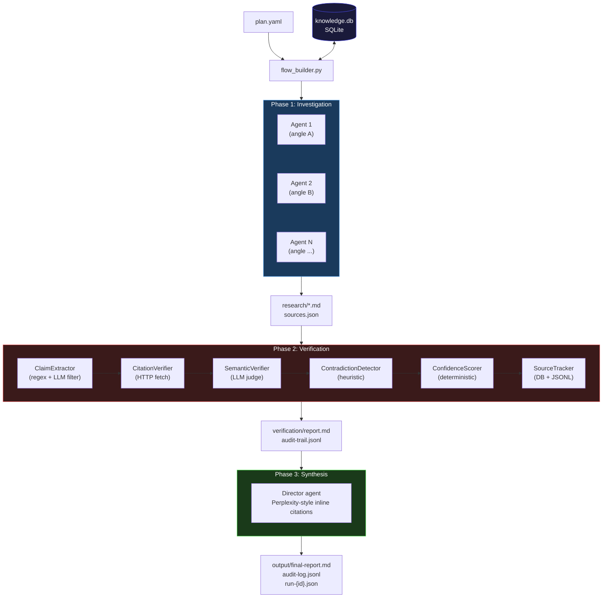
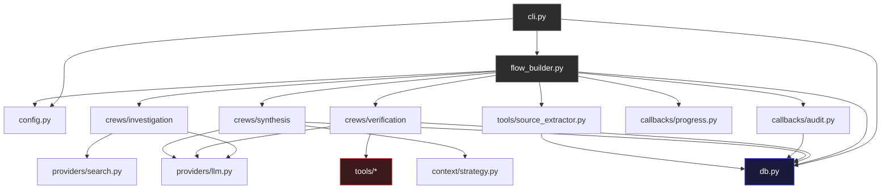
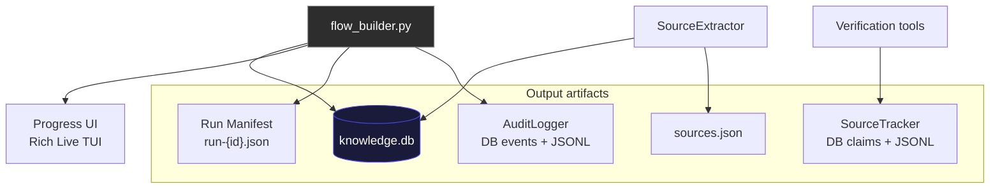
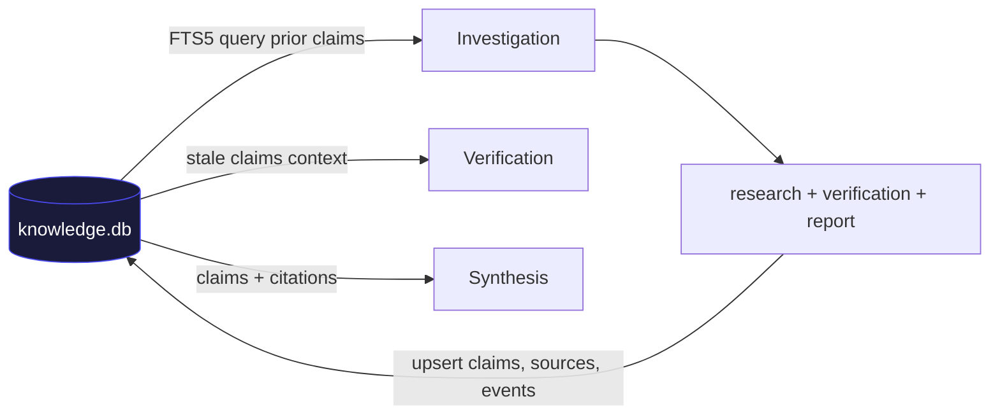

# Architecture

Technical reference for Recon's internals. For usage and quickstart, see
[README.md](README.md).

## Pipeline overview

Recon executes a 3-phase pipeline orchestrated by `flow_builder.py`:



| Phase | Agents | Max iterations | LLM calls | Output |
|-------|--------|----------------|-----------|--------|
| Investigation | quick=1, standard=3, deep=5 | 10 / 25 / 40 | Yes (web search + report) | `research/*.md`, `sources.json` |
| Verification | 1 fact-checker | 10 / 25 / 40 | Claim extraction LLM filter + semantic verifier | `verification/report.md`, `audit-trail.jsonl` |
| Synthesis | 1 director | -- | Yes (final report with inline citations) | `output/final-report.md`, `audit-log.jsonl`, `run-{id}.json` |

Each phase is a CrewAI crew with its own agents, tasks, and tools. The flow
builder wires them together, manages timeouts (SIGALRM), tracks tokens/cost,
and persists everything to the knowledge database.

## Knowledge database (`db.py`)

SQLite-backed persistence layer that stores everything across runs.
Always-on by default (`knowledge.db`). Uses WAL mode for concurrent reads.

### Schema (8 tables + FTS5)

| Table | Purpose |
|-------|---------|
| `runs` | Pipeline execution metadata (topic, model, depth, duration) |
| `phase_metrics` | Per-phase timing, status, output files |
| `token_usage` | Token counts + estimated cost per phase |
| `claims` | Extracted claims with verification status and confidence |
| `claim_sources` | Evidence URLs linked to claims with support type |
| `claim_history` | Verification audit trail (status changes over time) |
| `sources` | Global URL registry with reliability scores |
| `events` | Pipeline events (phase transitions, agent actions) |
| `claims_fts` | FTS5 virtual table for keyword search over claims |

Auto-sync triggers keep `claims_fts` in sync with `claims` table inserts,
updates, and deletes.

### Dual-write strategy

All writers (AuditLogger, SourceTracker, SourceExtractor) write to both the
legacy JSONL files and the SQLite database. DB writes are wrapped in
`contextlib.suppress(Exception)` so failures never break the pipeline.

## Module dependencies



## Project structure

```
src/recon/
  __init__.py              # Package version
  config.py                # Pydantic models: ReconPlan, KnowledgeConfig, PROVIDER_PRICING
  cli.py                   # Typer CLI entry point (10 commands)
  db.py                    # SQLite knowledge database (8 tables, FTS5, migrations)
  flow_builder.py          # Pipeline orchestrator with DB integration

  providers/
    llm.py                 # LLM factory -- 9 OpenAI-compatible providers
    search.py              # Search tool factory -- 4 providers

  crews/
    investigation/
      crew.py              # Researcher agents: memory, ONNX embedder, hierarchical (deep)
      config/
        agents.yaml
        tasks.yaml
    verification/
      crew.py              # Fact-checker: semantic verifier, guardrails, knowledge context
      config/
        agents.yaml
        tasks.yaml
    synthesis/
      crew.py              # Director agent: claims context, inline citations, memory
      config/
        agents.yaml
        tasks.yaml

  tools/
    __init__.py
    _helpers.py            # Shared parse_tool_input() utility
    claim_extractor.py     # Two-stage: regex prefilter + LLM batch filter
    citation_verifier.py   # HTTP fetch + term matching
    semantic_verifier.py   # LLM judge: SUPPORTS/CONTRADICTS/INSUFFICIENT/UNRELATED
    confidence_scorer.py   # Deterministic 0.0-1.0 scoring
    contradiction_detector.py  # Cross-source consistency check
    source_tracker.py      # Dual-write: DB claims/sources + JSONL
    source_extractor.py    # URL extraction + DB sources + sources.json

  callbacks/
    progress.py            # Rich Live TUI with verification metrics
    audit.py               # Dual-write: DB events + JSONL audit log

  context/
    strategy.py            # Token counting + context window management

  templates/               # 4 YAML plan templates
    market-research.yaml
    competitive-analysis.yaml
    technical-landscape.yaml
    opportunity-finder.yaml

tests/                     # 401 tests, all mocked (no API keys needed)
  conftest.py
  test_config.py
  test_cli.py
  test_providers.py
  test_templates.py
  test_tools.py
  test_flow.py
  test_context.py
  test_db.py
  test_memory.py           # KnowledgeConfig + crew feature tests
```

## Verification tools

The verification phase combines deterministic tools with LLM-powered analysis.

```mermaid
flowchart LR
    MD["research/*.md"] --> CE["ClaimExtractor\nprefilter + LLM filter"]
    CE --> |"claims[]"| CV["CitationVerifier\nHTTP fetch + term match"]
    CV --> SV["SemanticVerifier\nLLM evidence judge"]
    SV --> |"status per claim"| CD["ContradictionDetector\ncross-claim compare"]
    CD --> CS["ConfidenceScorer\ndeterministic 0.0-1.0"]
    CS --> ST["SourceTracker\nDB + JSONL write"]
    ST --> OUT["verification/\nreport.md\naudit-trail.jsonl"]

    style CE fill:#4a2a00,stroke:#ee8a2a,color:#fff
    style CV fill:#4a2a00,stroke:#ee8a2a,color:#fff
    style SV fill:#2a004a,stroke:#8a2aee,color:#fff
    style CD fill:#4a2a00,stroke:#ee8a2a,color:#fff
    style CS fill:#4a2a00,stroke:#ee8a2a,color:#fff
    style ST fill:#4a2a00,stroke:#ee8a2a,color:#fff
```



### ClaimExtractorTool (`claim_extractor.py`)

Two-stage extraction pipeline:

1. **Pre-filter heuristics**: Rejects markdown noise (table fragments,
   bibliography entries, bold-label artifacts, incomplete sentences). Strips
   Sources/References sections before extraction.
2. **LLM batch filter**: Validates quality, rejects remaining garbage,
   decomposes compound claims into atomic verifiable statements. Graceful
   fallback to regex-only on any LLM error.

- Detects 5 claim types: `statistic`, `pricing`, `date`, `attribution`, `quote`
- Configurable `max_claims` cap

### CitationVerifierTool (`citation_verifier.py`)

Fetches a cited URL and checks whether the claim's key terms appear in the
page content.

- Strips HTML, extracts key terms from the claim
- Match threshold: >= 70% terms found = `VERIFIED`
- Returns: `VERIFIED`, `PARTIALLY_VERIFIED`, `UNVERIFIABLE`, or `ERROR`
- Per-domain rate limiting (1 second default)

### SemanticVerifierTool (`semantic_verifier.py`)

LLM-based semantic verification that goes beyond keyword matching.

- Asks the LLM whether the evidence actually supports the claim
- Returns verdict: `SUPPORTS`, `CONTRADICTS`, `INSUFFICIENT`, `UNRELATED`
- Includes confidence score (0.0-1.0) and reasoning
- Graceful fallback on LLM error

### ConfidenceScorerTool (`confidence_scorer.py`)

Scores each claim 0.0 -- 1.0 based on deterministic rules:

- Base score from verification status (VERIFIED=0.8, PARTIAL=0.5, etc.)
- Bonus: +0.05 per additional source (up to +0.15)
- Bonus: +0.05 if primary source found
- Labels: `HIGH` (>=0.7), `MEDIUM` (>=0.4), `LOW` (>=0.2), `VERY_LOW`

### ContradictionDetectorTool (`contradiction_detector.py`)

Compares two claims for factual contradictions:

- Number extraction with K/M/B normalization, 15% tolerance
- Year comparison: >= 2 year difference = contradiction
- Negation pattern detection
- Returns: `CONSISTENT`, `CONTRADICTED`, or `AMBIGUOUS`

### SourceTrackerTool (`source_tracker.py`)

Dual-write provenance tracking:

- JSONL: `verification/audit-trail.jsonl` (one line per claim)
- DB: `claims`, `claim_sources`, `claim_history` tables
- Maps verification status to support types (VERIFIED->supports, etc.)

## Source extractor (post-processing)

`source_extractor.py` runs after investigation, not during verification.

- Extracts and deduplicates all URLs from research markdown files
- Writes `research/sources.json` with counts by URL, document, and domain
- Writes each unique URL to the DB `sources` table
- Not a CrewAI tool -- called directly by `flow_builder.py`

## Configuration model

`config.py` defines Pydantic models for plan validation:

```python
class ReconPlan:
    topic: str
    questions: list[str]
    focus: str | None
    depth: Depth                    # quick | standard | deep
    verify: bool
    provider: str                   # LLM provider name
    model: str | None
    search: SearchConfig
    investigations: list[Investigation]
    verification: VerificationConfig
    synthesis: SynthesisConfig
    knowledge: KnowledgeConfig      # DB path, embedder, stale_after_days
    auto_questions: bool            # auto-generate sub-questions per angle
    output_dir / research_dir / verification_dir: Path
```

```python
class KnowledgeConfig:
    enabled: bool = True            # Always-on by default
    db_path: str = "./knowledge.db"
    embedder: str = "onnx"          # Local ONNX embedder (~80MB, no API key)
    stale_after_days: int = 30
```

Plans load from YAML files or are built inline from CLI flags (`--topic`,
`--depth`, etc.).

## CrewAI features unlocked (v0.3)

| Feature | Where | Notes |
|---------|-------|-------|
| `memory=True` | All crews | ONNX embedder, local (~80MB), no API key |
| `Process.hierarchical` | Investigation (DEEP) | Research Director manages agents |
| `reasoning=True` | Investigation agents (DEEP) | Chain-of-thought reasoning |
| `allow_delegation=True` | Investigation agents (DEEP) | Agents can delegate sub-tasks |
| `guardrail` | Verification report task | Validates report structure |
| `step_callback` / `task_callback` | Investigation crew | Forwarded for observability |
| `usage_metrics` | All crews | Token tracking via `CrewOutput.token_usage` |

## Context management

`context/strategy.py` handles fitting research content into the LLM context
window:

- **Strategy.DIRECT**: Content fits within token limit, pass as-is
- **Strategy.TRUNCATE**: Content exceeds limit, truncate to fit

Token counting uses `tiktoken` with `cl100k_base` encoding.

## Observability



### Audit logger (`callbacks/audit.py`)

Dual-write strategy:
- JSONL entries to `output/audit-log.jsonl`
- DB inserts to `events` table
- Tracks `run_id`, phase starts/ends, agent actions, token counts
- DB failure never breaks the pipeline

### Progress UI (`callbacks/progress.py`)

Rich Live TUI showing:
- Real-time phase progress with spinners
- Live verification metrics (claims found, verified, contradicted)
- Knowledge DB summary at pipeline end (claims, tokens, cost, sources)

### Run manifest (`flow_builder.py`)

Written to `output/run-{id}.json` after pipeline completion.

### Token tracking + cost estimation

`CrewOutput.token_usage` is captured after each phase and written to the
`token_usage` table. Cost estimation uses `PROVIDER_PRICING` in `config.py`.

## CLI commands

| Command | Description |
|---------|-------------|
| `recon run [plan.yaml]` | Run the full pipeline. Accepts `--topic`, `--depth`, `--provider`, `--model`, `--verify/--no-verify`, `--dry-run`, `--verbose`, `--memory`, `--force`, `--auto-questions/--no-auto-questions`. |
| `recon init` | Create a plan file from a template. `--template`, `--output`. |
| `recon templates` | List available plan templates. |
| `recon verify <dir>` | Standalone fact-checking on existing research files. |
| `recon status [dir]` | Show pipeline execution status from audit log. |
| `recon rerun <plan>` | Re-run a specific phase. `--phase`. |
| `recon claims` | Browse verified claims. `--db`, `--run`, `--status`, `--search`, `--limit`. |
| `recon history <id>` | Show verification history for a claim. `--db`. |
| `recon stats` | Global or per-run statistics. `--db`, `--run`. |
| `recon reverify` | List stale claims needing re-verification. `--db`, `--days`, `--topic`, `--limit`. |

## LLM providers

Recon uses an OpenAI-compatible interface for all providers. The factory is in
`providers/llm.py`.

| Provider | Base URL | API Key Env Var | Notes |
|----------|----------|-----------------|-------|
| OpenRouter (default) | `https://openrouter.ai/api/v1` | `OPENROUTER_API_KEY` | 25+ free models |
| Google Gemini | `https://generativelanguage.googleapis.com/v1beta/openai` | `GEMINI_API_KEY` | Generous free tier |
| Groq | `https://api.groq.com/openai/v1` | `GROQ_API_KEY` | Free, fast inference |
| Kimi | `https://api.moonshot.cn/v1` | `KIMI_API_KEY` | Free tier |
| Anthropic | `https://api.anthropic.com/v1` | `ANTHROPIC_API_KEY` | |
| OpenAI | `https://api.openai.com/v1` | `OPENAI_API_KEY` | |
| Ollama | `http://localhost:11434/v1` | -- | Local, unlimited |
| Custom | User-defined | `RECON_API_KEY` | Any OpenAI-compatible endpoint |

## Search providers

Factory in `providers/search.py`.

| Provider | API Key Env Var | Free tier |
|----------|-----------------|-----------|
| Tavily (default) | `TAVILY_API_KEY` | 1000 calls/month |
| Brave Search | `BRAVE_API_KEY` | 2000 calls/month |
| Serper | `SERPER_API_KEY` | 2500 calls/month |
| Exa | `EXA_API_KEY` | Limited free |

## Plan file format

### Simple

```yaml
topic: "AI agent frameworks in 2026"
questions:
  - "What frameworks exist and what is their adoption?"
  - "What business models work in this space?"
depth: deep
verify: true
```

### Advanced

```yaml
topic: "Competitive analysis of vector databases"
depth: standard
verify: true
provider: kimi
model: kimi-k2.5

search:
  provider: tavily

investigations:
  - id: features
    name: "Feature Comparison"
    questions:
      - "What features does each database offer?"
    instructions: "Create a comparison table with benchmarks."

  - id: pricing
    name: "Pricing Analysis"
    questions:
      - "What are the pricing models?"
    instructions: "Include free tier details."

verification:
  min_confidence: 0.6
  require_primary_source: false
  max_queries_per_claim: 2
  max_fetches_per_claim: 2
  timeout_per_fetch: 10

synthesis:
  instructions: "Rank databases by developer experience."

knowledge:
  enabled: true
  db_path: ./knowledge.db
  embedder: onnx
  stale_after_days: 30

output_dir: ./output
research_dir: ./research
verification_dir: ./verification
```

## Investigation details

### Auto sub-question generation

When `auto_questions: true` (default), `generate_sub_questions()` in
`investigation/crew.py` makes 1 LLM call per investigation angle to generate
focused sub-questions. Controlled by `--auto-questions/--no-auto-questions`
CLI flag.

### Source diversity

Investigation agent backstories include SOURCE DIVERSITY RULES requiring 3+
source types (academic, industry, news, official docs, etc.) to avoid
single-perspective bias.

### Hierarchical process (DEEP depth)

When depth is DEEP and there are multiple investigation angles, the crew uses
`Process.hierarchical` with a Research Director manager agent. Researcher
agents get `reasoning=True` and `allow_delegation=True`.

### Incremental runs

`recon run` skips investigations whose output files already exist unless
`--force` is passed. This enables incremental re-runs where you add new
angles without re-running completed ones.

## Knowledge system

SQLite `knowledge.db` replaces the legacy memvid `.mv2` system. Always-on
by default, no external dependencies.



- **Prior knowledge**: FTS5 search over claims table before investigation
- **Stale claims**: Claims older than `stale_after_days` are surfaced for re-verification
- **Cross-run enrichment**: Claims seen multiple times get `times_seen` incremented
- **Inline citations**: Synthesis agent formats Perplexity-style `[1]` references

## Docker

`docker-compose.yaml` mounts `plans/`, `output/`, `research/`, and
`verification/` directories. Environment variables for API keys are passed
through.

```bash
docker compose up
```

Or standalone:

```bash
docker run -v $(pwd):/workspace \
  -e OPENROUTER_API_KEY=sk-... \
  -e TAVILY_API_KEY=tvly-... \
  recon-ai run /workspace/plan.yaml
```
