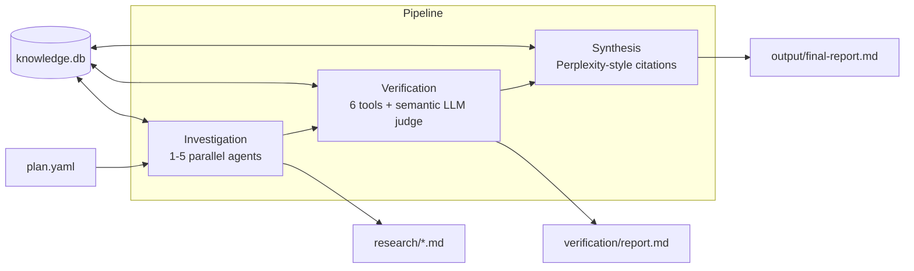

# Recon

[](https://github.com/pguerrerolinares/recon/actions)
[](https://pypi.org/project/recon-ai/)
[](https://pypi.org/project/recon-ai/)
[](LICENSE)

**AI research that tells you what it got wrong.**

Most AI research tools generate impressive-looking reports. None of them tell
you which parts are actually true. Recon does.

Recon runs parallel AI agents to investigate a topic from multiple angles, then
**verifies every factual claim** against its cited source. The output is a
research report where each claim is marked as verified, partially verified,
unverifiable, or contradicted -- with a confidence score.

## What you get

```
recon run --topic "AI agent frameworks in 2026" --depth deep
```

```
research/               <- raw investigation reports (one per angle)
verification/
  report.md             <- claim-level fact-check: status + confidence
  audit-trail.jsonl     <- machine-readable provenance per claim
output/
  final-report.md       <- synthesized report, confidence-weighted
```

From a real run (MCP ecosystem research):
- 19 claims extracted, 13 verified, 0 contradicted
- Overall reliability score: 71.1%
- Each claim linked to its source URL + evidence excerpt

## Install

Python 3.12+.

```bash
pip install recon-ai
```

## Setup

You need one LLM API key and one search API key:

```bash
cp .env.example .env
# Set at minimum: OPENROUTER_API_KEY + TAVILY_API_KEY
```

## Usage

```bash
# Research a topic directly
recon run --topic "Your research question" --depth standard

# Use a plan file for more control
recon init --template market-research
# Edit plan.yaml, then:
recon run plan.yaml

# Fact-check existing research
recon verify ./research/

# Check what happened in a previous run
recon status

# Browse verified claims across all runs
recon claims --search "AI frameworks" --limit 20

# View verification history for a specific claim
recon history <claim_id>

# Show statistics (global or per-run)
recon stats
recon stats --run <run_id>

# Find stale claims needing re-verification
recon reverify --days 30
```

### Depth levels

| Depth | Agents | Best for |
|-------|--------|----------|
| `quick` | 1 | Fast answers, single-angle |
| `standard` | 3 | Balanced research |
| `deep` | 5 | Thorough multi-perspective analysis |

## How it works



The verification phase combines deterministic tools (regex extraction, HTTP
fetching, term matching) with an LLM-powered semantic verifier that judges
whether evidence truly supports each claim.

All runs are tracked in a local SQLite knowledge database that enables
cross-run learning, claim history, and re-verification of stale facts.

See [ARCHITECTURE.md](ARCHITECTURE.md) for the full technical breakdown.

## Providers

Works with any OpenAI-compatible LLM and 4 search APIs:

| LLM | Search |
|-----|--------|
| OpenRouter (default), Gemini, Groq, Kimi, Anthropic, OpenAI, Ollama, Custom | Tavily (default), Brave, Serper, Exa |

```bash
recon run --topic "X" --provider anthropic --model claude-sonnet-4
```

## Knowledge database

Recon maintains a local SQLite database (`knowledge.db`) that tracks everything
across runs:

- **Claims**: All verified claims with confidence scores and evidence
- **Sources**: URL registry with reliability tracking
- **Runs**: Full pipeline execution history with token usage and cost
- **Events**: Detailed audit trail of agent actions

Features enabled by the knowledge DB:

- **FTS5 search**: Fast full-text search over all verified claims
- **Claim history**: Track how verification status changes over time
- **Stale detection**: Re-verify claims older than N days
- **Cross-run learning**: Claims seen multiple times build confidence
- **Prior knowledge**: New investigations start with relevant past findings

The database is always-on by default. No configuration needed.

## Plan file

Simple:
```yaml
topic: "AI agent frameworks in 2026"
questions:
  - "What frameworks exist and what is their adoption?"
  - "What gaps and opportunities remain?"
depth: deep
verify: true
```

Advanced plans support custom investigations, provider overrides, verification
thresholds, and synthesis instructions. See `examples/` and
[ARCHITECTURE.md](ARCHITECTURE.md#plan-file-format).

## Templates

```bash
recon templates                              # list available
recon init --template market-research        # market/competitive analysis
recon init --template competitive-analysis   # deep competitor comparison
recon init --template technical-landscape    # technology survey
recon init --template opportunity-finder     # gap analysis + ideas
```

## Docker

```bash
docker compose up
# or
docker run -v $(pwd):/workspace \
  -e OPENROUTER_API_KEY=sk-... \
  -e TAVILY_API_KEY=tvly-... \
  recon-ai run /workspace/plan.yaml
```

## Contributing

See [CONTRIBUTING.md](CONTRIBUTING.md).

## License

[MIT](LICENSE)
